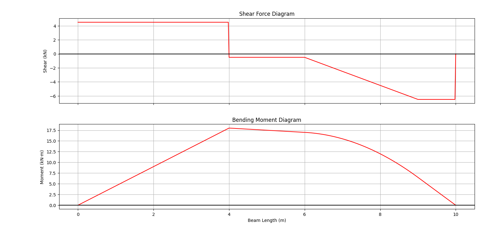

# Beam Analysis Tool V1

## 📌 Description
This is a Python-based Beam Analysis Tool developed for solving structural engineering problems.  
The program computes reactions, shear force, and bending moment for beams under different loading conditions.
It supports multiple types of loads and generates shear force and bending moment diagrams.

---

## ⚙️ Features
- Supports:
  - Simply Supported Beam
  - Fixed Support Beam (Left or Right)
- Handles multiple load types:
  - Point Load
  - Uniformly Distributed Load (UDL)
  - Triangular Load (Increasing / Decreasing)
  - Applied Moment
- Computes:
  - Support reactions
  - Shear Force Diagram
  - Bending Moment Diagram
- Displays:
  - Reactions (Shear and Moment)
  - +Vmax, -Vmax
  - +Mmax, -Mmax
- Step-by-step guided user input

---

## 📥 Example Input

- Beam Type: Simply Supported  
- Beam Length: 10 m  
- Point Load: 5 kN at 4 m  
- UDL: 2 kN/m from 6 m to 9 m

---

## 📤 Output

The program generates the Shear Force and Bending Moment Diagram:



---

## 🛠️ Technologies Used
- Python
- Matplotlib

---

## 🚀 How to Run
1. Install Python
2. Install required library:

```bash
pip install matplotlib
